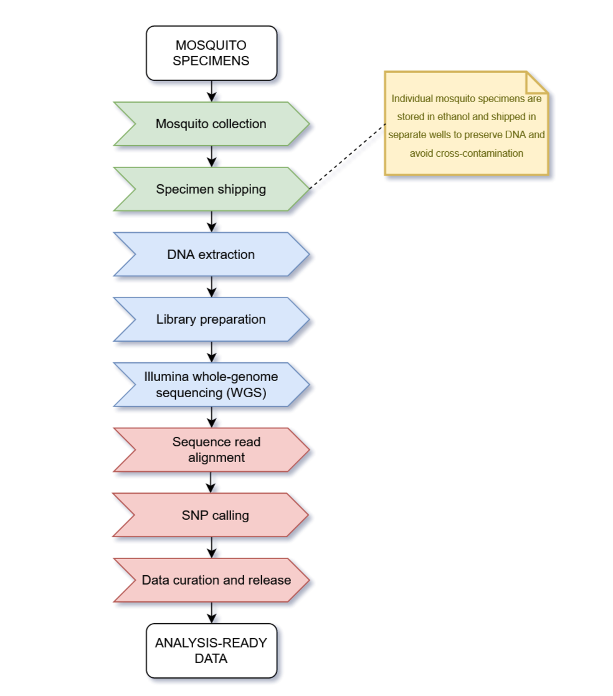

### 1. Process of Data collection in MalariaGen

- The basic workflow involves collecting mosquitoes, shipping them to sequencing facilities, preparing DNA samples and performing whole-genome sequencing, then processing the resulting data so they are ready for analysis, as shown below.
- Note that raw genome sequence data is not particularly useful by itself, and so the sequence reads are processed through **variant-calling pipelines** which identify different types of genetic variation between individual mosquitoes.
- The results of variant-calling pipelines are then passed through a number of quality control, filtering and annotation steps to ensure data quality. We call this process **data curation**.
- The **analysis-ready genome variation data** is then made available to all partners in the collaboration. This data can then be analysed to answer questions about the surveillance of mosquito populations, such as whether new forms of insecticide resistance are emerging and spreading.

### 2. MalariaGen Data:
- Since, genetic mutations could be either SNPs (Single Nucleotide polymorphisms) or CNVs (Copy Number Variants). Different variant calling pipelines are used to identify these mutations. 
- Time and Place of where the mosquitos were sequenced is equally important. This data is called **sample metadata**. 

### 3. EDA
**Comparing:**
- Comparing different mosquito species
- Comparing mosquitoes from different geographical locations
- Comparing mosquitoes from different time points

**When comparing these groups, we:**
* Look for interesting patterns (differences or similarities within/between them)
* Explore how those patterns relate to other variables (e.g., variations in climate, geography, ecosystem, land use, vector biology, vector control intervention coverage, malaria transmission, _etc._) 

**The steps:**
0. Background reading
1. Population sampling
2. Taxonomic population structure
3. Geographical population structure
4. Cohort choice
5. Genetic diversity
6. Insecticide resistance variant frequencies
7. Genome-wide selection scans
8. Adaptive gene flow
9. Review & refine key findings

---
### References:
1. https://github.com/DeepakSilaych/gsoc_2025/blob/main/final_report%2Ffinal_report.md
2. https://deepaksilaych.me/blog/gsoc-2025-anopheles-classifier
3. https://github.com/DeepakSilaych/gsoc_2025/blob/main/proposals/malariagen.pdf
4. https://github.com/malariagen/vector-taxon-classifier-prediction/blob/master/notebooks/01_basic_setup.ipynb
5. https://anopheles-genomic-surveillance.github.io/home.html
6. https://datascienceforbio.com/genomic-data-analysis/?utm_source=chatgpt.com
7. https://anopheles-genomic-surveillance.github.io/home.html